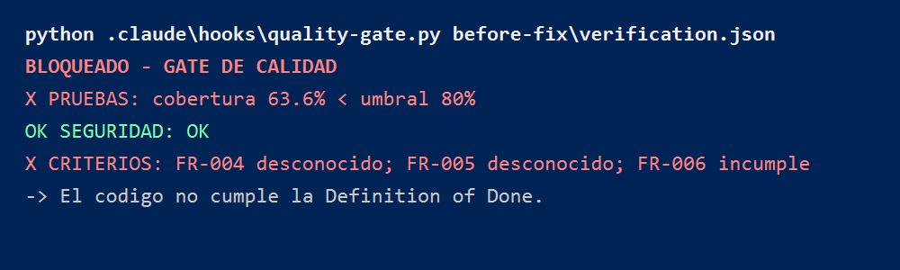
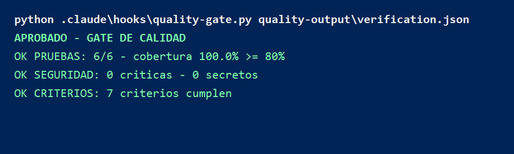

# Quality & Governance Agent - CitaSalud

Este repositorio contiene mi entrega del Quality & Governance Agent para la Unidad 3. Trabaje sobre el servicio `citasalud-agenda`, un proyecto Spring Boot con Gradle, y use el `spec.md` de Spec Kit como fuente de verdad para validar pruebas, seguridad y criterios de aceptacion.

## Evidencia general

El resultado final del proceso fue **APROBADO** por el gate de Definition of Done.

La evidencia principal esta en:

- `examples/citasalud-agenda/quality-output/verification.json`
- `examples/citasalud-agenda/quality-output/report.html`
- `examples/citasalud-agenda/quality-output/semgrep.json`
- `examples/citasalud-agenda/quality-output/gate-output.txt`
- `examples/citasalud-agenda/quality-output/screenshots/gate-bloqueado.png`
- `examples/citasalud-agenda/quality-output/screenshots/gate-aprobado.png`
- `examples/citasalud-agenda/quality-output/before-fix/verification.json`
- `examples/citasalud-agenda/quality-output/before-fix/gate-output.txt`

## 1. Proyecto de entrada

Prepare el proyecto `citasalud-agenda` como servicio de entrada. El servicio esta implementado con Spring Boot y Gradle, y contiene la gestion de reservas de citas medicas.

La especificacion usada como fuente de criterios esta en:

- `examples/citasalud-agenda/specs/001-agenda-citas/spec.md`

Desde ese archivo tome los Functional Requirements `FR-001` a `FR-006`, los escenarios de aceptacion y el edge case de concurrencia.

## 2. Configuracion del Quality Agent

Configure el agente de calidad con sus piezas principales:

- Constitucion del agente: `CLAUDE.md`
- Skill de calidad: `.claude/skills/quality/SKILL.md`
- Subagente auditor: `.claude/agents/auditor.md`
- Subagente de seguridad: `.claude/agents/security-reviewer.md`
- Flujos de calidad: `.claude/commands/quality/`
- Hook del gate: `.claude/hooks/quality-gate.py`
- Generador del reporte: `.claude/scripts/build-report.py`
- Conexion MCP de Semgrep: `.mcp.json`

Con esto el agente puede verificar el codigo y decidir si pasa o se bloquea segun la Definition of Done.

## 3. Pilar de pruebas

Verifique la suite de pruebas del proyecto con Gradle y JaCoCo. El resultado final fue:

- Pruebas ejecutadas: `6`
- Pruebas aprobadas: `6`
- Fallos: `0`
- Errores: `0`
- Cobertura: `100.0%`

La cobertura quedo registrada desde JaCoCo con `22` lineas cubiertas y `0` lineas faltantes. Esta evidencia esta consolidada en `verification.json`.

## 4. Pilar de seguridad

Revise el codigo Java/Spring con Semgrep y tambien valide que no existan secretos expuestos.

Resultado:

- Vulnerabilidades criticas: `0`
- Hallazgos altos: `0`
- Secretos expuestos: `0`
- Archivos escaneados: `4`

La salida del analisis esta guardada en:

- `examples/citasalud-agenda/quality-output/semgrep.json`

Como no hubo hallazgos, no existen lineas vulnerables que reportar. Esa ausencia queda respaldada por el archivo de Semgrep y por el bloque `security` de `verification.json`.

## 5. Pilar de criterios

Cruce los requisitos del `spec.md` contra pruebas concretas del proyecto.

| Criterio | Evidencia |
| --- | --- |
| FR-001 | `reservaFranjaLibre_ok` |
| FR-002 | `reservaOtraFranja_ok` |
| FR-003 | `reservaFranjaOcupada_secuencial_rechaza` |
| FR-004 | `apiRest_creaYListaReservas` |
| FR-005 | `apiRest_franjaOcupada_devuelveConflict` |
| FR-006 | `reservaFranjaOcupada_concurrente_rechaza` |
| Edge case de concurrencia | `reservaFranjaOcupada_concurrente_rechaza` |

La prueba de concurrencia usa dos solicitudes sobre la misma franja y valida que solo una reserva sea aceptada.

## 6. Veredicto trazable

Consolide el resultado en:

- `examples/citasalud-agenda/quality-output/verification.json`

Ese archivo contiene la evidencia de los tres pilares: pruebas, seguridad y criterios. No marque ningun requisito como cumplido sin asociarlo a una prueba o reporte generado.

## 7. Demostracion del gate

Primero deje evidencia de un bloqueo. El gate bloqueo porque faltaba cubrir correctamente el caso de concurrencia y la cobertura no alcanzaba el umbral.

Evidencia del bloqueo:

- `examples/citasalud-agenda/quality-output/before-fix/verification.json`
- `examples/citasalud-agenda/quality-output/before-fix/gate-output.txt`
- `examples/citasalud-agenda/quality-output/screenshots/gate-bloqueado.png`

Despues resolvi el problema agregando la prueba concurrente, pruebas para el controller REST y sincronizacion en `AgendaService`.

Evidencia final:

- `examples/citasalud-agenda/quality-output/verification.json`
- `examples/citasalud-agenda/quality-output/gate-output.txt`
- `examples/citasalud-agenda/quality-output/screenshots/gate-aprobado.png`

El resultado final fue:

- Pruebas: pasan
- Seguridad: pasa
- Criterios: pasan
- Gate: aprobado

## 8. Reporte visual

Genere el reporte visual del agente en:

- `examples/citasalud-agenda/quality-output/report.html`

El reporte muestra el veredicto final, los tres pilares y la trazabilidad de los criterios verificados.

## Conclusion

El Quality Agent permitio demostrar que la calidad no se aprueba solo porque el codigo compile. Primero detecto el faltante de concurrencia, bloqueo la entrega y luego aprobo cuando las pruebas, seguridad y criterios quedaron completos.

## Reflexion

**Que cambio al dar por terminado el codigo?**  
Ahora no lo cierro solo porque funcione; necesito evidencia y que el gate lo apruebe.

**Que pilar costo mas?**  
Criterios, porque cada FR debia tener una prueba real, especialmente el caso concurrente.

**Para que sirve en un equipo real?**  
Para evitar entregas incompletas y detectar riesgos de seguridad antes de subir cambios.
